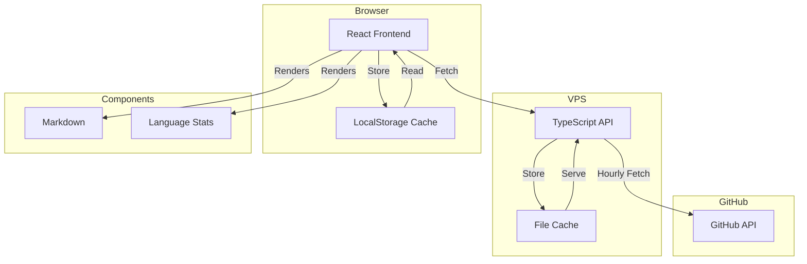

# Personal Knowledge Base

A React application for exploring and searching GitHub repositories, providing an organized view of repository metadata with README previews and language statistics.

## System Architecture



## Features

- GitHub repository explorer with search and metadata display
- Markdown rendering with code highlighting and diagram support
- Language statistics visualization
- Two-tier caching system (server + client)
- Dark/light theme support

## Technical Stack

- React + TypeScript
- Vite
- Express.js
- Tailwind CSS
- Lucide React icons
- react-markdown
- Mermaid.js

## Directory Structure

```
personal-kb/
├── src/                               # Frontend source
│   ├── components/                    # React components
│   │   ├── GitHubExplorer/           # Main repository explorer
│   │   │   ├── index.tsx             # Repository listing and search
│   │   │   └── LanguageStats.tsx     # Language distribution visualization
│   │   └── MarkdownRenderer/         # README rendering component
│   │       └── index.tsx             # Markdown with code highlighting & diagrams
│   ├── config/
│   │   └── api.ts                    # API configuration
│   ├── styles/
│   │   └── index.css                 # Global styles and Tailwind configuration
│   ├── utils/
│   │   └── cache.ts                  # LocalStorage caching implementation
│   ├── App.tsx                       # Root application component
│   └── main.tsx                      # Application entry point
├── server/                           # Backend source
│   ├── data/                         # Development cache directory
│   ├── src/
│   │   ├── types.ts                 # Shared type definitions
│   │   ├── githubCache.ts           # GitHub data caching logic
│   │   └── index.ts                 # Express server setup
│   └── tsconfig.json                # TypeScript configuration
├── index.html                        # HTML entry point
├── tailwind.config.js               # Tailwind CSS configuration
└── package.json                     # Project dependencies and scripts
```

## Development

1. Clone the repository:
```bash
git clone https://github.com/matthewabbott/personal-kb.git
cd personal-kb
```

2. Install dependencies:
```bash
# Install frontend dependencies
npm install

# Install backend dependencies
cd server
npm install
cd ..
```

3. Start development servers:
```bash
# Terminal 1: Start frontend
npm run dev

# Terminal 2: Start backend
cd server
npm run dev

# Or instead run both frontend and backend with one command
npm run dev:all
```

## Production Deployment

The application is deployed at [mbabbott.com/personal-kb](https://mbabbott.com/personal-kb)

### Deployment Steps

1. Set up the directory structure:
```bash
# Create necessary directories
mkdir -p /var/www/html/personal-kb/{app,api/data}
```

2. Deploy the frontend:
```bash
# Clone and build
cd /root
git clone https://github.com/matthewabbott/personal-kb.git
cd personal-kb

# Build frontend
npm install
npm run build

# Copy frontend files
cp -r dist/* /var/www/html/personal-kb/app/
```

3. Deploy the backend:
```bash
# Build and deploy API
cd server
npm install
npm run build
cp -r dist package.json /var/www/html/personal-kb/api/

# Install production dependencies
cd /var/www/html/personal-kb/api
npm install --production

# Set up PM2 for process management
npm install -g pm2
pm2 start dist/index.js --name personal-kb-api
```

4. Configure nginx:
```nginx
# Add to your nginx configuration
location /personal-kb {
    alias /var/www/html/personal-kb/app;
    try_files $uri $uri/ /personal-kb/index.html;
    
    location ~* \.js$ {
        add_header Content-Type application/javascript;
    }
    
    location ~* \.css$ {
        add_header Content-Type text/css;
    }
}

location /personal-kb-api/ {
    proxy_pass http://localhost:3001/;
    proxy_http_version 1.1;
    proxy_set_header Upgrade $http_upgrade;
    proxy_set_header Connection 'upgrade';
    proxy_set_header Host $host;
    proxy_cache_bypass $http_upgrade;
}
```

5. Update API configuration:
```typescript
// src/config/api.ts
export const API_BASE_URL = process.env.NODE_ENV === 'production'
  ? '/personal-kb-api'  // Will be proxied through nginx
  : 'http://localhost:3001/api';
```