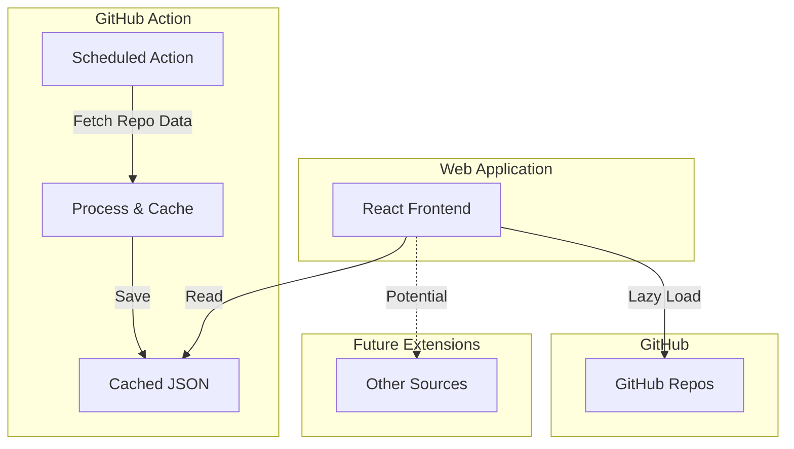

# Personal Knowledge Base

A webapp for exploring and searching my GitHub repositories, planned to be hosted on my webpage.

## (Planned) System Architecture



## Features

### Current
Uhhh, look we're still a bit early, alright...

### Planned
- GitHub repository explorer
  - Repository metadata display
  - Search functionality
  - Cached data updates via GitHub Actions
- Repository content exploration
  - README previews
  - File browser
  - Code snippet search
- Repository statistics
  - Language distribution
  - Commit activity
  - Contribution graphs

## Technical Stack

- **Frontend**: React + TypeScript
- **Build Tool**: Vite
- **UI Components**: Radix UI
- **Icons**: Lucide React
- **Deployment**: NGINX on VPS
- **Data Updates**: GitHub Actions

## Development

1. Clone the repository:
```bash
git clone https://github.com/matthewabbott/personal-kb.git
cd personal-kb
```

2. Install dependencies:
```bash
npm install
```

3. Start development server:
```bash
npm run dev
```

## Deployment

The application is (TODO: slated to be) deployed at [mbabbott.com/personal-kb](https://mbabbott.com/personal-kb)
