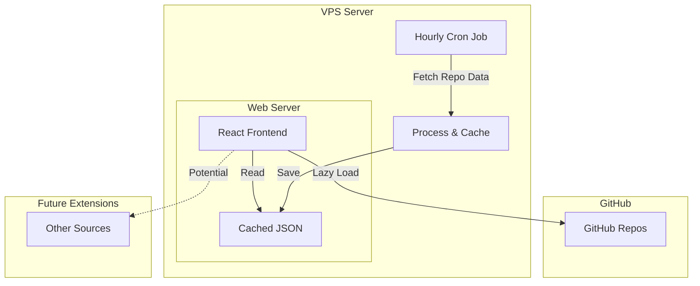

# Personal Knowledge Base

A webapp for exploring and searching my GitHub repositories, hosted on my webpage.

## System Architecture



## Features

### Current
- GitHub repository explorer
  - Repository metadata display
  - Search functionality
  - Real-time sorting by last commit date
  - Cached data updates via VPS cron job

### Planned
- Repository content exploration
  - README previews
  - File browser
  - Code snippet search
- Repository statistics
  - Language distribution
  - Commit activity
  - Contribution graphs
- Additional knowledge sources integration

## Technical Stack

- **Frontend**: React + TypeScript
- **Build Tool**: Vite
- **UI Components**: Radix UI
- **Icons**: Lucide React
- **Deployment**: NGINX on VPS
- **Data Updates**: Hourly cron job

## Development

1. Clone the repository:
```bash
git clone https://github.com/matthewabbott/personal-kb.git
cd personal-kb
```

2. Install dependencies:
```bash
npm install
```

3. Start development server:
```bash
npm run dev
```

## Production Deployment

The application is deployed at [mbabbott.com/personal-kb](https://mbabbott.com/personal-kb)

### Deployment Steps

1. Clone and build:
```bash
# Clone the repo for development/building
cd /root
git clone https://github.com/matthewabbott/personal-kb.git
cd personal-kb

# Create the production directory
mkdir -p /var/www/html/personal-kb/data

# Build the project
npm install
npm run build

# Copy the built files to the web directory
cp -r dist/* /var/www/html/personal-kb/
```

2. Set up data caching:
```bash
# Make data cache script executable
chmod +x /root/update-github-cache.sh

# Add to crontab to run hourly
crontab -e
# Add: 0 * * * * /root/personal-kb/update-github-cache.sh
```

3. Configure nginx:
```nginx
# Add to your nginx configuration
	location /personal-kb {
		alias /var/www/html/personal-kb;
		try_files $uri $uri/ /personal-kb/index.html;
		
		location ~* \.js$ {
			add_header Content-Type application/javascript;
		}
		
		location ~* \.css$ {
			add_header Content-Type text/css;
		}
	}

	location /personal-kb/data/ {
		alias /var/www/html/personal-kb/data/;
		add_header Cache-Control "no-cache";
		add_header Access-Control-Allow-Origin "*";
	}
```