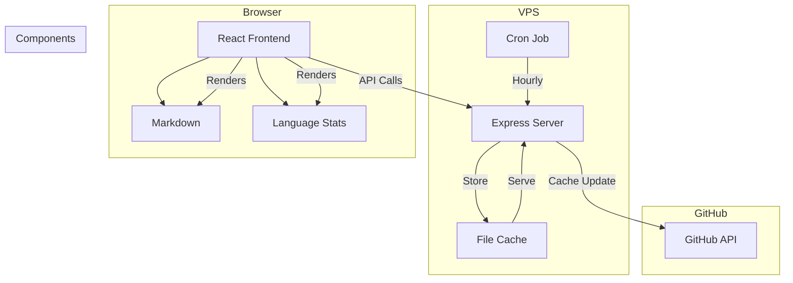

# Personal Knowledge Base

A React application for exploring and searching my GitHub repositories. Displays repository metadata, README previews, and language statistics.

## System Architecture



## Features

- GitHub repository explorer with search and metadata display
- Markdown rendering with code highlighting and diagram support
- Language statistics visualization
- Two-tier caching system (server + client)
- Dark/light theme support

## Technical Stack

- React + TypeScript
- Vite
- Express.js
- Tailwind CSS
- Lucide React icons
- react-markdown
- Mermaid.js

## Directory Structure

```
personal-kb/
├── src/                              # Frontend source
│   ├── components/                   # React components
│   │   ├── GitHubExplorer/          # Main repository explorer
│   │   │   ├── SearchBar.tsx        # Search input component
│   │   │   ├── RepositoryCard.tsx   # Repository card component
│   │   │   ├── LanguageStats.tsx    # Language distribution visualization
│   │   │   ├── useGitHubData.ts     # Data fetching hook
│   │   │   ├── useReadmeExpansion.ts# README handling hook
│   │   │   └── index.tsx            # Main explorer component
│   │   └── MarkdownRenderer/        # README rendering component
│   │       └── index.tsx
│   ├── config/
│   │   └── api.ts                    # API configuration
│   ├── styles/
│   │   └── index.css                 # Global styles and Tailwind configuration
│   ├── utils/
│   │   └── cache.ts                  # LocalStorage caching implementation
│   ├── App.tsx                       # Root application component
│   └── main.tsx                      # Application entry point
├── server/
│   ├── src/
│   │   ├── index.ts                  # Express server setup
│   │   ├── githubCache.ts           # GitHub repository cache system
│   │   └── types.ts                 # TypeScript type definitions
│   ├── data/                        # Cache directory for GitHub data
│   └── .env                         # Environment configuration
├── index.html                       # HTML entry point
├── tailwind.config.js               # Tailwind CSS configuration
└── package.json                     # Project dependencies and scripts
```

## Development

1. Clone the repository:
```bash
git clone https://github.com/matthewabbott/personal-kb.git
cd personal-kb
```

2. Install dependencies:
```bash
# Install frontend dependencies
npm install

# Install backend dependencies
cd server
npm install
cd ..
```

3. Start development servers:
```bash
# Terminal 1: Start frontend
npm run dev

# Terminal 2: Start backend
cd server
npm run dev

# Or instead run both frontend and backend with one command
npm run dev:all
```

## Production Deployment

The application is deployed at [https://mbabbott.com/personal-kb/](https://mbabbott.com/personal-kb/)

### Deployment Steps

1. Environment Setup:
```bash
# On the deployment server, modify the .env file in the server directory
echo "GITHUB_USER=your-github-username" > server/.env
```

2. Build and Deploy:
```bash
# Clone the repository
git clone https://github.com/matthewabbott/personal-kb.git
cd personal-kb

# Install dependencies and build frontend
npm install
npm run build

# Build server
cd server
npm install
npm run build

# 1. Create all necessary directories
sudo mkdir -p /var/www/html/personal-kb/{data,server}

# 2. Copy frontend files (from dist) to main personal-kb directory
sudo cp -r ../dist/* /var/www/html/personal-kb/

# 3. Copy server files
sudo cp -r dist package.json /var/www/html/personal-kb/server/
cd /var/www/html/personal-kb/server
npm install --production
```

3. Set up PM2:
```bash
# Install PM2 globally if not already installed
sudo npm install -g pm2

# Create PM2 ecosystem file
cat > ecosystem.config.js << EOL
module.exports = {
  apps: [{
    name: 'personal-kb-server',
    script: 'dist/index.js',
    env_production: {
      NODE_ENV: 'production',
      GITHUB_USER: 'your-github-username',
      PORT: 3001
    }
  }]
}
EOL

# Start the server with PM2
pm2 start ecosystem.config.js --env production
pm2 save
pm2 startup
```

4. Configure nginx:
```nginx
# personal-kb application
location /personal-kb {
    alias /var/www/html/personal-kb;
    try_files $uri $uri/ /personal-kb/index.html;
    
    # Handle JavaScript files
    location ~* \.js$ {
        add_header Content-Type application/javascript;
    }
    
    # Handle CSS files
    location ~* \.css$ {
        add_header Content-Type text/css;
    }
}

# personal-kb API endpoints
location /personal-kb/api/ {
    proxy_pass http://localhost:3001/api/;
    proxy_http_version 1.1;
    proxy_set_header Upgrade $http_upgrade;
    proxy_set_header Connection 'upgrade';
    proxy_set_header Host $host;
    proxy_cache_bypass $http_upgrade;
}

# Cache directory access
location /personal-kb/data/ {
    alias /var/www/html/personal-kb/data/;
    add_header Cache-Control "no-cache";
    add_header Access-Control-Allow-Origin "*";
}
```